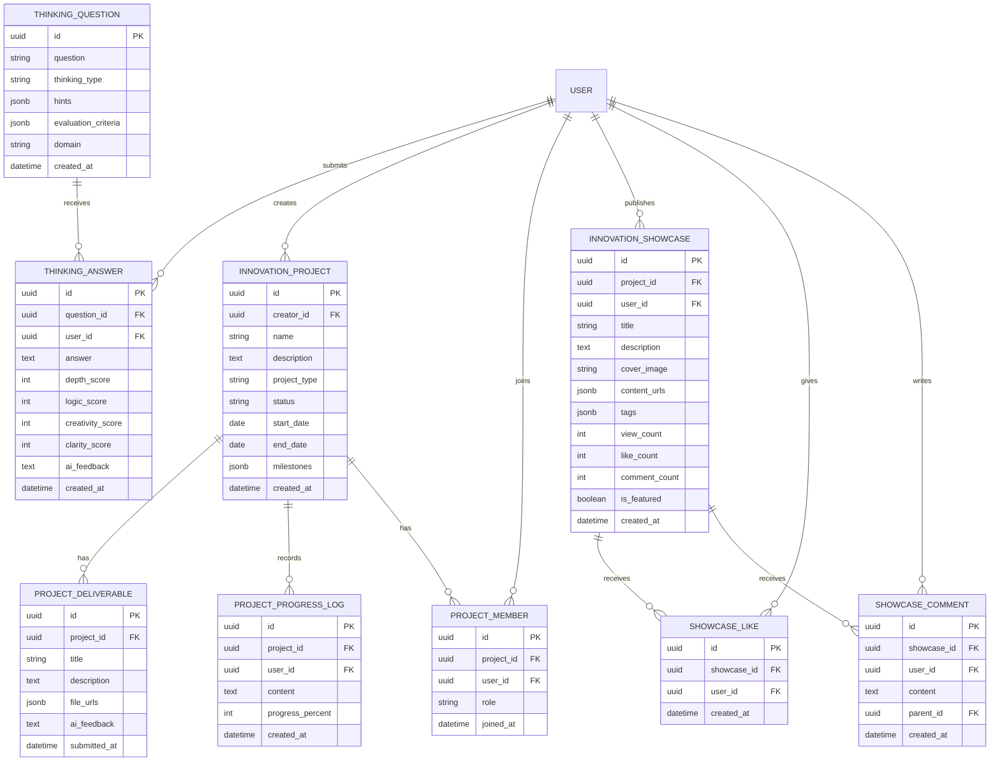

# Aigc For Study 架构设计文档 - 创新能力培养模块补充

**版本:** v1.2  
**更新日期:** 2025-05-09  
**更新内容:** 新增创新能力培养模块架构设计

---

## 1. 模块概述

创新能力培养模块是Aigc For Study的核心差异化功能，包含四个子模块：

| 子模块 | 核心功能 | 技术复杂度 | MVP优先级 |
|--------|----------|------------|-----------|
| 创新思维训练 | AI生成思考题、AI评价回答 | 中 | P0 |
| 项目实践 | 项目管理、进度跟踪 | 低 | P0 |
| 创意挑战 | 挑战赛、投票系统 | 中 | P2（后续迭代） |
| 创新成果展示 | 展示墙、点赞评论 | 低 | P1 |

---

## 2. 模块架构设计

### 2.1 整体架构

```
┌─────────────────────────────────────────────────────────────┐
│                      创新能力培养模块                         │
├─────────────────────────────────────────────────────────────┤
│  ┌──────────────┐  ┌──────────────┐  ┌──────────────┐      │
│  │ 创新思维训练  │  │  项目实践    │  │ 创新成果展示  │      │
│  │  (Thinking)  │  │  (Project)   │  │  (Showcase)  │      │
│  └──────────────┘  └──────────────┘  └──────────────┘      │
│           │                │                │               │
│           └────────────────┼────────────────┘               │
│                            │                                │
│                    ┌───────▼───────┐                        │
│                    │  AI服务层     │                        │
│                    │  - 思考题生成  │                        │
│                    │  - 回答评价    │                        │
│                    │  - 项目建议    │                        │
│                    │  - 成果评语    │                        │
│                    └───────────────┘                        │
└─────────────────────────────────────────────────────────────┘
```

### 2.2 服务分层

```
前端层 (Vue.js)
    │
    ├── 创新思维训练页面
    ├── 项目实践页面
    └── 成果展示页面
    │
    ▼
API层 (FastAPI)
    │
    ├── /api/v1/innovation/thinking-questions
    ├── /api/v1/innovation/projects
    └── /api/v1/innovation/showcases
    │
    ▼
服务层
    │
    ├── ThinkingQuestionService (思考题服务)
    ├── ProjectService (项目服务)
    └── ShowcaseService (展示服务)
    │
    ▼
AI服务层
    │
    ├── QuestionGeneratorAI (思考题生成)
    ├── AnswerEvaluatorAI (回答评价)
    └── ProjectAdvisorAI (项目建议)
    │
    ▼
数据层 (PostgreSQL + Redis)
```

---

## 3. 数据库设计

### 3.1 ER模型



### 3.2 核心表结构

#### 思考题表 (thinking_questions)

```sql
CREATE TABLE thinking_questions (
    id UUID PRIMARY KEY DEFAULT gen_random_uuid(),
    question TEXT NOT NULL,
    thinking_type VARCHAR(50) NOT NULL,  -- divergent/critical/reverse/system/application
    hints JSONB,
    evaluation_criteria JSONB,
    domain VARCHAR(100),
    created_at TIMESTAMP DEFAULT CURRENT_TIMESTAMP
);

CREATE INDEX idx_thinking_questions_type ON thinking_questions(thinking_type);
CREATE INDEX idx_thinking_questions_domain ON thinking_questions(domain);
```

#### 思考题回答表 (thinking_answers)

```sql
CREATE TABLE thinking_answers (
    id UUID PRIMARY KEY DEFAULT gen_random_uuid(),
    question_id UUID NOT NULL REFERENCES thinking_questions(id),
    user_id UUID NOT NULL REFERENCES users(id),
    answer TEXT NOT NULL,
    depth_score INT CHECK (depth_score BETWEEN 1 AND 10),
    logic_score INT CHECK (logic_score BETWEEN 1 AND 10),
    creativity_score INT CHECK (creativity_score BETWEEN 1 AND 10),
    clarity_score INT CHECK (clarity_score BETWEEN 1 AND 10),
    ai_feedback TEXT,
    created_at TIMESTAMP DEFAULT CURRENT_TIMESTAMP
);

CREATE INDEX idx_thinking_answers_user ON thinking_answers(user_id);
CREATE INDEX idx_thinking_answers_question ON thinking_answers(question_id);
```

#### 创新项目表 (innovation_projects)

```sql
CREATE TABLE innovation_projects (
    id UUID PRIMARY KEY DEFAULT gen_random_uuid(),
    creator_id UUID NOT NULL REFERENCES users(id),
    name VARCHAR(200) NOT NULL,
    description TEXT,
    project_type VARCHAR(50),  -- tech/product/business/social/academic
    status VARCHAR(20) DEFAULT 'planning',  -- planning/ongoing/completed/paused
    start_date DATE,
    end_date DATE,
    milestones JSONB,
    created_at TIMESTAMP DEFAULT CURRENT_TIMESTAMP,
    updated_at TIMESTAMP DEFAULT CURRENT_TIMESTAMP
);

CREATE INDEX idx_innovation_projects_creator ON innovation_projects(creator_id);
CREATE INDEX idx_innovation_projects_status ON innovation_projects(status);
CREATE INDEX idx_innovation_projects_type ON innovation_projects(project_type);
```

#### 项目成员表 (project_members)

```sql
CREATE TABLE project_members (
    id UUID PRIMARY KEY DEFAULT gen_random_uuid(),
    project_id UUID NOT NULL REFERENCES innovation_projects(id) ON DELETE CASCADE,
    user_id UUID NOT NULL REFERENCES users(id),
    role VARCHAR(50) DEFAULT 'member',  -- owner/admin/member
    joined_at TIMESTAMP DEFAULT CURRENT_TIMESTAMP,
    UNIQUE(project_id, user_id)
);

CREATE INDEX idx_project_members_project ON project_members(project_id);
CREATE INDEX idx_project_members_user ON project_members(user_id);
```

#### 项目进度记录表 (project_progress_logs)

```sql
CREATE TABLE project_progress_logs (
    id UUID PRIMARY KEY DEFAULT gen_random_uuid(),
    project_id UUID NOT NULL REFERENCES innovation_projects(id) ON DELETE CASCADE,
    user_id UUID NOT NULL REFERENCES users(id),
    content TEXT NOT NULL,
    progress_percent INT CHECK (progress_percent BETWEEN 0 AND 100),
    created_at TIMESTAMP DEFAULT CURRENT_TIMESTAMP
);

CREATE INDEX idx_project_progress_project ON project_progress_logs(project_id);
```

#### 创新成果展示表 (innovation_showcases)

```sql
CREATE TABLE innovation_showcases (
    id UUID PRIMARY KEY DEFAULT gen_random_uuid(),
    project_id UUID REFERENCES innovation_projects(id),
    user_id UUID NOT NULL REFERENCES users(id),
    title VARCHAR(200) NOT NULL,
    description TEXT,
    cover_image VARCHAR(500),
    content_urls JSONB,
    tags JSONB,
    view_count INT DEFAULT 0,
    like_count INT DEFAULT 0,
    comment_count INT DEFAULT 0,
    is_featured BOOLEAN DEFAULT FALSE,
    created_at TIMESTAMP DEFAULT CURRENT_TIMESTAMP
);

CREATE INDEX idx_innovation_showcases_user ON innovation_showcases(user_id);
CREATE INDEX idx_innovation_showcases_featured ON innovation_showcases(is_featured);
CREATE INDEX idx_innovation_showcases_tags ON innovation_showcases USING gin(tags);
```

---

## 4. API接口设计

### 4.1 创新思维训练接口

| 方法 | 端点 | 说明 |
|------|------|------|
| GET | /api/v1/innovation/thinking-questions/today | 获取今日思考题 |
| POST | /api/v1/innovation/thinking-questions/{id}/answer | 提交回答 |
| GET | /api/v1/innovation/thinking-questions/my-answers | 获取我的回答记录 |
| GET | /api/v1/innovation/thinking-questions/stats | 获取思维训练统计 |

### 4.2 项目实践接口

| 方法 | 端点 | 说明 |
|------|------|------|
| POST | /api/v1/innovation/projects | 创建项目 |
| GET | /api/v1/innovation/projects | 获取项目列表 |
| GET | /api/v1/innovation/projects/{id} | 获取项目详情 |
| PUT | /api/v1/innovation/projects/{id} | 更新项目 |
| POST | /api/v1/innovation/projects/{id}/progress | 更新进度 |
| POST | /api/v1/innovation/projects/{id}/members | 添加成员 |
| DELETE | /api/v1/innovation/projects/{id}/members/{userId} | 移除成员 |
| GET | /api/v1/innovation/projects/suggestions | 获取AI项目建议 |

### 4.3 成果展示接口

| 方法 | 端点 | 说明 |
|------|------|------|
| POST | /api/v1/innovation/showcases | 发布成果 |
| GET | /api/v1/innovation/showcases | 获取成果列表 |
| GET | /api/v1/innovation/showcases/{id} | 获取成果详情 |
| POST | /api/v1/innovation/showcases/{id}/like | 点赞 |
| DELETE | /api/v1/innovation/showcases/{id}/like | 取消点赞 |
| POST | /api/v1/innovation/showcases/{id}/comments | 评论 |
| GET | /api/v1/innovation/showcases/{id}/comments | 获取评论列表 |

---

## 5. AI服务设计

### 5.1 思考题生成服务

```python
class ThinkingQuestionGenerator:
    THINKING_TYPES = {
        'divergent': '发散思维',
        'critical': '批判思维',
        'reverse': '逆向思维',
        'system': '系统思维',
        'application': '创新应用'
    }
    
    def generate_question(self, domain: str, thinking_type: str) -> dict:
        """生成开放性思考题"""
        prompt = f"""
        你是一位创新思维训练专家。请为"{domain}"领域生成一道"{self.THINKING_TYPES.get(thinking_type, thinking_type)}"类型的开放性思考题。

        要求：
        1. 问题具有启发性，没有标准答案
        2. 能激发学生深入思考和讨论
        3. 与{domain}领域相关，贴近实际
        4. 难度适中，适合大学生思考

        请以JSON格式返回：
        {{
            "question": "问题内容",
            "hints": ["提示1", "提示2", "提示3"],
            "evaluation_criteria": ["评价标准1", "评价标准2", "评价标准3"]
        }}
        """
        return self.ai_client.generate(prompt, response_format="json")
```

### 5.2 回答评价服务

```python
class AnswerEvaluator:
    def evaluate_answer(self, question: str, answer: str, criteria: list) -> dict:
        """评价学生回答"""
        prompt = f"""
        你是一位创新思维评价专家。请评价学生对以下思考题的回答。

        问题：{question}

        学生回答：{answer}

        评价标准：{', '.join(criteria)}

        请从以下四个维度评分（1-10分）：
        1. 思考深度：回答是否深入，是否有独到见解
        2. 逻辑性：论述是否清晰，论证是否有力
        3. 创新性：是否有创新观点或独特视角
        4. 表达清晰度：语言是否流畅，表达是否清晰

        请以JSON格式返回：
        {{
            "depth_score": 8,
            "logic_score": 7,
            "creativity_score": 9,
            "clarity_score": 8,
            "feedback": "具体评价和改进建议..."
        }}
        """
        return self.ai_client.generate(prompt, response_format="json")
```

### 5.3 项目建议服务

```python
class ProjectAdvisor:
    def suggest_projects(self, user_profile: dict, domain: str) -> list:
        """生成项目建议"""
        prompt = f"""
        你是一位创新项目顾问。请根据用户画像推荐创新项目。

        用户画像：
        - 兴趣领域：{user_profile.get('interests', '未指定')}
        - 技能水平：{user_profile.get('skill_level', '中级')}
        - 可用时间：{user_profile.get('available_time', '每周10小时')}
        - 目标领域：{domain}

        请推荐3-5个适合的创新项目，以JSON数组格式返回：
        [
            {{
                "name": "项目名称",
                "description": "项目描述",
                "difficulty": "easy/medium/hard",
                "estimated_time": "预计完成时间",
                "skills_needed": ["所需技能1", "所需技能2"],
                "milestones": ["里程碑1", "里程碑2", "里程碑3"]
            }}
        ]
        """
        return self.ai_client.generate(prompt, response_format="json")
```

---

## 6. 前端组件设计

### 6.1 组件结构

```
src/views/innovation/
├── ThinkingTraining.vue       # 思维训练页面
├── ProjectPractice.vue        # 项目实践页面
├── ProjectDetail.vue          # 项目详情页面
├── CreateProject.vue          # 创建项目页面
├── ShowcaseWall.vue           # 成果展示墙
├── ShowcaseDetail.vue         # 成果详情页面
└── PublishShowcase.vue        # 发布成果页面

src/components/innovation/
├── ThinkingQuestionCard.vue   # 思考题卡片
├── AnswerForm.vue             # 回答表单
├── EvaluationResult.vue       # 评价结果
├── ProjectCard.vue            # 项目卡片
├── ProgressTimeline.vue       # 进度时间线
├── MemberList.vue             # 成员列表
├── ShowcaseCard.vue           # 成果卡片
└── CommentSection.vue         # 评论区
```

### 6.2 状态管理

```typescript
// stores/innovation.ts
export const useInnovationStore = defineStore('innovation', {
  state: () => ({
    // 思维训练
    todayQuestions: [],
    myAnswers: [],
    thinkingStats: null,
    
    // 项目实践
    myProjects: [],
    currentProject: null,
    projectSuggestions: [],
    
    // 成果展示
    showcases: [],
    currentShowcase: null,
  }),
  
  actions: {
    // 思维训练
    async fetchTodayQuestions() { ... },
    async submitAnswer(questionId: string, answer: string) { ... },
    
    // 项目实践
    async createProject(data: ProjectData) { ... },
    async updateProgress(projectId: string, progress: ProgressData) { ... },
    async fetchProjectSuggestions(domain: string) { ... },
    
    // 成果展示
    async fetchShowcases(params: QueryParams) { ... },
    async publishShowcase(data: ShowcaseData) { ... },
    async likeShowcase(showcaseId: string) { ... },
    async commentShowcase(showcaseId: string, content: string) { ... },
  }
})
```

---

## 7. 开发计划

### 7.1 MVP阶段（5月20日前）

| 任务 | 预计工时 | 负责人 | 交付日期 |
|------|----------|--------|----------|
| 数据库表设计与创建 | 0.5天 | 后端 | 5/12 |
| 思考题生成API | 1天 | 后端 | 5/13 |
| 回答评价API | 1天 | 后端 | 5/14 |
| 项目管理API | 1天 | 后端 | 5/15 |
| 成果展示API | 0.5天 | 后端 | 5/16 |
| 思维训练页面 | 1天 | 前端 | 5/16 |
| 项目实践页面 | 1天 | 前端 | 5/17 |
| 成果展示页面 | 1天 | 前端 | 5/18 |
| 联调测试 | 1天 | 全团队 | 5/19 |

### 7.2 后续迭代

| 功能 | 优先级 | 预计工时 |
|------|--------|----------|
| 思维导图工具 | P2 | 3天 |
| 团队协作增强 | P2 | 2天 |
| 创意挑战赛系统 | P2 | 3天 |
| 荣誉体系 | P2 | 2天 |
| 成果导出 | P3 | 1天 |

---

## 8. 验收标准

### 8.1 功能验收

- [ ] AI能生成高质量的开放性思考题
- [ ] 学生能提交回答并获得AI评价
- [ ] 学生能创建和管理创新项目
- [ ] 项目进度能实时更新
- [ ] 成果展示墙能正常展示
- [ ] 点赞评论功能正常

### 8.2 性能验收

- [ ] 思考题生成响应时间 < 5秒
- [ ] AI评价响应时间 < 10秒
- [ ] 页面加载时间 < 2秒

---

**文档变更记录**

| 版本 | 日期 | 变更内容 | 作者 |
|------|------|----------|------|
| v1.2 | 2025-05-09 | 新增创新能力培养模块架构设计 | |
